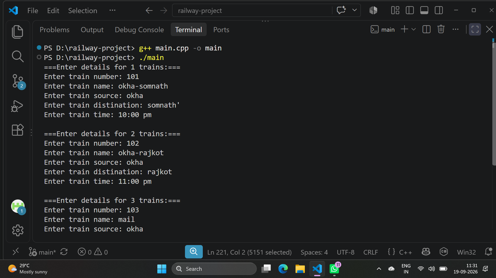

# 🚆 Railway Reservation System

#
A simple **Railway Reservation System** developed in **C++** using **Object-Oriented Programming (OOP)** concepts.

This project allows users to add train records, display all train records, and search for a train using its train number.

## 📌 Features

* Add new train record
* Display all train records
* Search train by train number
* Store train number, name, source, destination, and time
* Uses C++ classes and objects
* Uses constructors and destructors
* Uses static data member
* Uses getter and setter functions
* Menu-driven program

## 🛠️ Technologies Used

* **Language:** C++
* **Concepts:** OOP
* **Other:**   visual Studio Code, git,github 
* **Header Files:**


## 📂 Folder Structure
│
├── main.cpp
├── output.png
└── README.md
```
## output


## 🧑‍💻 C++ Concepts Used

### 1. Class and Object

The project contains two classes:

```cpp
class Train
```

and

```cpp
class RailwaySystem
```

### 2. Constructor

The `Train` class uses a default constructor and parameterized constructor.

```cpp
Train()
{
    train_number = 0;
    train_name = "";
    train_source = "";
    train_distination = "";
    train_time = "";

    train_count++;
}
```

### 3. Destructor

A destructor is used to decrease the train count when an object is destroyed.

```cpp
~Train()
{
    train_count--;
}
```

### 4. Static Data Member

The project uses a static variable to maintain the number of `Train` objects.

```cpp
static int train_count;
```

It is initialized outside the class:

```cpp
int Train::train_count = 0;
```

### 5. Encapsulation

Train data members are declared as `private` and accessed through setter and getter functions.

Example:

```cpp
void set_train_number(int number)
{
    train_number = number;
}

int get_train_number()
{
    return train_number;
}
```

### 6. Array of Objects

The `RailwaySystem` class stores up to 100 train objects.

```cpp
Train trains[100];
```

## 📋 Menu Options

When the program starts, the following menu is displayed:

```text
===== Railway Reservation System =====
1. Add new train record
2. Display all train records
3. Search train by number
4. Exit program
```

### Option 1: Add New Train

Allows the user to enter:

* Train number
* Train name
* Source
* Destination
* Time

Example:

```text
Enter train number: 101
Enter train name: Gujarat Express
Enter train source: Ahmedabad
Enter train distination: Mumbai
Enter train time: 10:30 AM
```

### Option 2: Display All Trains

Displays all train records stored in the system.

Example:

```text
the train number is: 101
the train name is: Gujarat Express
the train source is: Ahmedabad
the train distination is: Mumbai
the train time is : 10:30 AM
```

### Option 3: Search Train

The user enters a train number and the program searches for the matching train.

Example:

```text
Enter a train number: 101

the train number is: 101
the train name is: Gujarat Express
the train source is: Ahmedabad
the train distination is: Mumbai
the train time is : 10:30 AM
```

### Option 4: Exit

Terminates the program.

```text
Exiting...Goodbye!
```

## ▶️ How to Run

### Step 1: Save the file

Save the C++ program as:

```text
railway.cpp
```

### Step 2: Compile

Using GCC:

```bash
g++ main.cpp -o main
```

### Step 3: Run

Windows:

```bash
main.exe
```   
## 👨‍💻 Project Type

**C++ OOP Mini Project – Railway Reservation System**

## 👨‍💻 Author/Devloper Name
Gaurav Pipavat
  *  Role: C++ Developer / Student
  *  Project: Railway Reservation System


